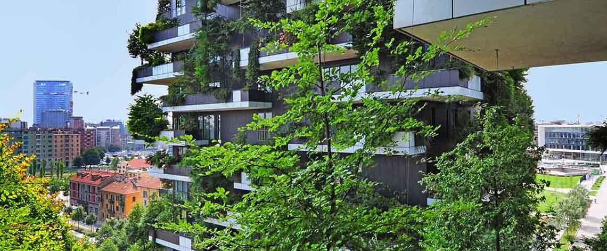

### [Ecodiseño y economía circular](https://santanaolmo.github.io/Ecodesign/)

A partir de las parejas del trabajo anterior, y las empresas escogidas de los sectores profesionales, vamos a realizar un proyecto un poco más ambicioso relacionado con el ecodiseño y economía circular.

Cada grupo, dentro de la medida de sus posibilidades, va a crear un portal web/multiplataforma o herramienta que controle de la empresa escogida anteriormente simulando una página de Vinted.

De todo lo que ofrece la empresa, escoger el producto o servicio para publicarlo del que se va a realizar el análisis o descripción relacionado con ecodiseño y economía circular.

Los pasos/ elementos que tienen que contener son los siguientes: 

Normativa ambiental implicada.
Pasos de como convertir el producto o servicio en economía circular que colgamos en nuestro portal Vinted utilizando los principios del ecodiseño y el ciclo de vida del producto.
Aplicar el ecodiseño al producto/ servicio escogido.
Destacar los factores de su minimización del impacto ambiental.

El proyecto tiene que tener su parte de documentación en un word o herramienta utilizada que son los 3 puntos equivalentes al examen y la presentación del portal se grabara en video con su explicación que equipara a los 5 puntos de la actividad practica.

¡Buena idea! Aquí te explico cómo se podrían **implementar** estas estrategias en Airbnb desde la perspectiva del **ecodiseño y la economía circular**, incluyendo incentivos para los anfitriones:  

---

### **1. Cabañas ecológicas (Construcción sostenible) 🌱🏡**  
✅ **Cómo implementarlo**:  
- Incentivar la construcción de alojamientos con **materiales sostenibles** (madera certificada, bambú, barro, corcho).  
- Fomentar el uso de **arquitectura bioclimática** para reducir el consumo energético (ventanas grandes, techos verdes).  
- Dar visibilidad en la plataforma a estos alojamientos con una **categoría especial** (“Airbnb Eco-friendly”).  

✅ **Incentivo para anfitriones**:  
- Airbnb podría ofrecer **descuentos en tasas de servicio** a los anfitriones con certificaciones de sostenibilidad.  
- Crear una **insignia especial** para que los viajeros prefieran estos alojamientos.  

---

### **2. Energía renovable en alojamientos 🔋☀️**  
✅ **Cómo implementarlo**:  
- Airbnb podría lanzar un **programa de subvención parcial** para anfitriones que instalen **paneles solares** o usen energías renovables.  
- Dar prioridad en los resultados de búsqueda a los alojamientos con energías limpias.  

✅ **Incentivo para anfitriones**:  
- Airbnb podría devolver un **porcentaje de la inversión** a los anfitriones que suban pruebas de su sistema de energía renovable.  

---

### **3. Decoración con materiales reciclados 🛋️♻️**  
✅ **Cómo implementarlo**:  
- Crear un **programa de verificación** donde los anfitriones puedan mostrar que al menos un **50% de sus muebles son reciclados o reutilizados**.  
- Dar visibilidad a los alojamientos con este tipo de decoración en una **categoría especial**.  

✅ **Incentivo para anfitriones**:  
- Airbnb podría **ofrecer asesoramiento** o alianzas con tiendas de segunda mano para ayudar en la compra de muebles reciclados.  

---

### **4. Alojamientos sostenibles urbanos 🏙️💚**  
✅ **Cómo implementarlo**:  
- Fomentar que los anfitriones utilicen **aislamientos térmicos eficientes** para reducir el consumo energético.  
- Incentivar el uso de **sistemas de recolección de agua de lluvia** o tecnologías de ahorro de agua.  

✅ **Incentivo para anfitriones**:  
- Airbnb podría dar **descuentos en la tarifa de servicio** a quienes adopten al menos **tres medidas de eficiencia energética**.  

---

### **5. Huertos urbanos en alojamientos 🌿🥬**  
✅ **Cómo implementarlo**:  
- Promocionar alojamientos con **huertos urbanos o jardines verticales** donde los huéspedes puedan recolectar frutas y verduras.  
- Airbnb podría asociarse con empresas de jardinería sostenible para ayudar a instalar estos espacios.  

✅ **Incentivo para anfitriones**:  
- Airbnb podría **premiar con visibilidad** en la plataforma a los anfitriones que demuestren tener un huerto.  
- Oportunidad de aumentar el precio de la estancia al ofrecer productos frescos como extra.  

---

### **6. Baños ecológicos 🚿💧**  
✅ **Cómo implementarlo**:  
- Exigir que los alojamientos sostenibles usen **sanitarios de bajo consumo**, duchas con **reducción de agua** y jabones biodegradables.  
- Airbnb podría vender **kits ecológicos de baño** para que los anfitriones los implementen fácilmente.  

✅ **Incentivo para anfitriones**:  
- Anfitriones que instalen estos sistemas recibirán **una insignia ecológica** en su perfil y promoción en las búsquedas.  

---

### **7. Gestión de residuos y reciclaje 🗑️🔄**  
✅ **Cómo implementarlo**:  
- Airbnb puede lanzar un **sistema de certificación de reciclaje** donde los anfitriones demuestren que separan residuos y fomentan el compostaje.  
- Dar acceso a un mapa con **puntos de reciclaje** cercanos en la app.  

✅ **Incentivo para anfitriones**:  
- Airbnb podría premiar a los alojamientos con **mayor compromiso ambiental** con descuentos en tarifas o mayor visibilidad.  

---

### **8. Movilidad sostenible 🚲🚶‍♂️**  
✅ **Cómo implementarlo**:  
- Incentivar que los alojamientos ofrezcan **bicicletas gratuitas** o acuerdos con servicios de transporte eléctrico.  
- Integrar en la app un **mapa de transporte público y carriles bici** cercanos.  

✅ **Incentivo para anfitriones**:  
- Airbnb podría **bonificar** a los anfitriones que ofrezcan opciones de transporte ecológico.  

---

### **9. Construcciones modulares y reutilizables 🏠🔁**  
✅ **Cómo implementarlo**:  
- Promover alojamientos que usen **casas modulares prefabricadas** de materiales reciclados.  
- Crear una categoría especial en Airbnb para **alojamientos desmontables o reutilizables**.  

✅ **Incentivo para anfitriones**:  
- Airbnb podría asociarse con empresas de construcción sostenible para ofrecer **descuentos** en este tipo de alojamientos.  

---

### 📌 **Conclusión**  
Estas acciones permitirían que Airbnb y sus anfitriones **reduzcan su impacto ambiental** y fomenten la economía circular. Al mismo tiempo, los **incentivos** ayudarían a que más personas adopten estas medidas.  

¿Qué te parece? ¿Quieres que adapte alguna idea o que incluya algo más? 🚀♻️
 